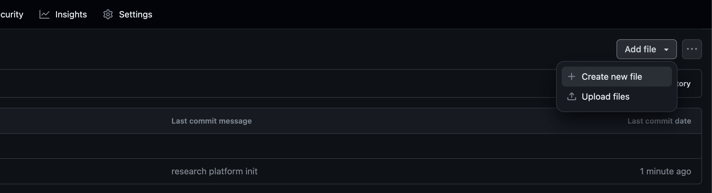

# Add a new project

To add a new project go to the https://github.com/mlinpl/research-platform/tree/main/_projects and
click the "Create new file" bottom as in the following image:

Copy the [project-schema.md](project-schema.md) content and then fill fields. If you have any doubts what and
how to fill the file, you can look at the example; [example-project.md](example-project.md),if any field doesn't apply
to you just delete it.

# Add a new lab

To add a new lab go to the https://github.com/mlinpl/research-platform/tree/main/_labs and
click the "Create new file" bottom as in the following image:

Copy the [lab-schema.md](lab-schema.md) content and then fill fields. If you have any doubts what and
how to fill the file, you can look at the example; [example-lab.md](example-lab.md),if any field doesn't apply
to you just delete it.